# Lab #2 Project Guide

## Overview

This lab will focus on the basic components found in most FPGA designs and how to structure HDL code for those components.  The basic components introduced include adders, counters, multiplexers, and look-up tables which will be used to construct timers and pulse-width modulators (PWM).  The completed design will generate a scanning pattern across the 10 LEDs as shown below.

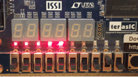

In addition to HDL components, the lab will introduce, by example, hierarchical modular design techniques, module parameterization, and design verification using the simulator.

In order to speed up the learning process, a code shell (framework) has been provided with the assignment which will provide examples of the coding techniques to be used in the implementation modules.  The framework combined with the implementation modules integrate to form the complete project.

Review the provided code to gain insight into proper HDL coding techniques that will be used throughout the remaining laboratory assignments.

### Project Assignment Overview

* Create the Quartus Project using the [Quartus Project Guide](QuartusProject-Guide.md)
* Review the [HDL Starter Guide](HDL-StarterGuide.md)
* Review the Lab Project [System Architecture](#system-architecture)
* Implement the design components following the [Lab Implementation Requirements](#lab-implementation-requirements)
* Debug the design using the [Simulator](#debugging-with-simulation)
* Build and load the design on the [development board](#load-the-design-on-the-dev-board)
* Document the results for the [lab report](../README.md#lab-report-requirements)
* Commit the finished design back into source control


## System Architecture

:information_source: The Lab Project Guides will include a _System Architecture_ section to provide a project overview and theory of operation for each module.  The actual lab assignment work starts in the _Lab Implementation Requirements_ section.

The Lab 2 project has one main functional block, the **CLS\_Scanner\_Module**, which is instantiated in the top-level module, **EECS301\_Lab2\_TopLevel**.  The CLS Scanner uses Pulse-Width Modulation (PWM) to adjust the LED brightness levels.  The back-and-forth animation is created by rotating ten different PWM signals, each with a different duty cycle width, through a multiplexer for each LED output.  The multiplexer changes the LED output every time the **CLS\_Scan\_Rate\_Timer** module generates a timer tick pulse.  The slider switch inputs, **SW[1:0]**, allow selecting between four different animation speeds.

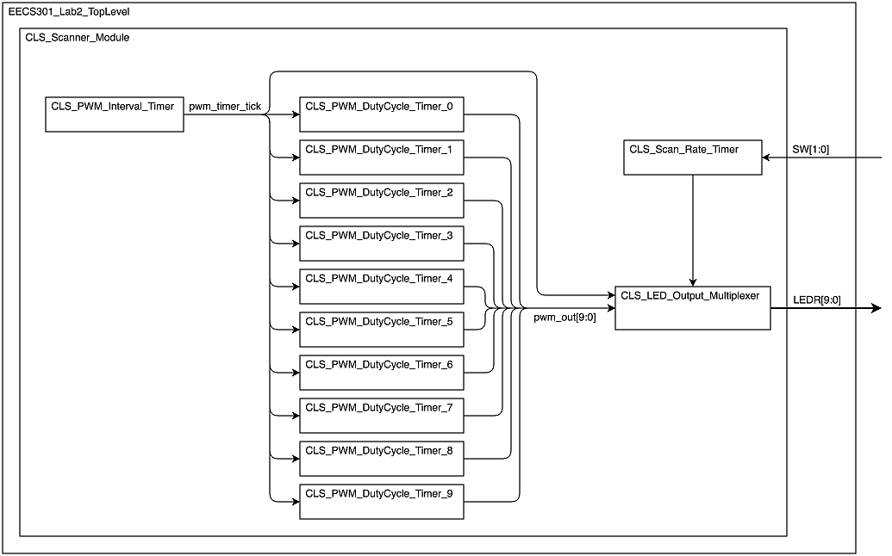

### Module Hierarchy

* `EECS301_Lab2_TopLevel`
	* `CLS_Scanner_Module`
		* `CLS_PWM_Interval_Timer`
		* `CLS_PWM_DutyCycle_Timer`
		* `CLS_Scan_Rate_Timer`
		* `CLS_LED_Output_Multiplexer`

### Development Board Hardware

This project utilizes all 10 Status LEDs and two Slider Switches from the development board.

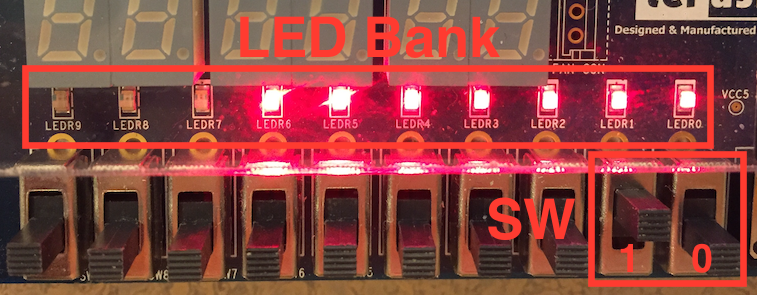

* The LEDs are used to display an animated pattern.
* Two slider switches, SW[0] and SW[1], select between 4 different timer rates as shown in the following table.

	| Setting | SW[1] | SW[0] |
	|---------|:-----:|:-----:|
	| 2 Hz    |  Off  |  Off  |
	| 8 Hz    |  Off  |  On   |
	| 16 Hz   |  On   |  Off  |
	| 32 Hz   |  On   |  On   |

### Provided Framework

:information_source: Each project will include a starting framework to make some aspects of the lab easier and to provide examples of proper coding technique and design structure. Reviewing the framework files will help completing the implementation parts of the lab.

The following list provides a description for each module (or file) included in the Lab 2 Framework:

* **EECS301\_Lab2\_TopLevel** (`EECS301_Lab2_TopLevel.v`)

	Every FPGA project has a top-level module which encapsulates the entire FPGA design and defines the signals mapped to physical pins on the FPGA.  

	Quartus will automatically route the port signals of the top-level module to pins of the FPGA.  These are the signals shown in the **Pin Planner** (after compilation) that were demonstrated in the first lab.  Care should be taken to insure the FPGA pin mapping matches the actual hardware layout.  Hardware can be damaged by assigning the wrong control signal to the wrong pin.

	:warning: **WARNING:** The names in the port map of the top level module must match those in the **Pin Planner** pin assignments.  Any additions, deletions, or changes to the top level module signal names must be updated in the pin assignments, otherwise the pin mapping will be incorrect.

	The Project Framework includes the full implementation for this module.  The module instantiates the **`CLS_Scanner_Module`** sub-module and defines port signals which map to the FPGA pins for hardware control.  There are unused port signals so stub code is provided to eliminate warnings.
	
* **CLS\_Scanner\_Module** (`CLS_Scanner_Module.v`)

	The **`CLS_Scanner_Module`** encapsulates the Cylon LED Scanner (CLS) functionality.  This is a structural module that does not implement any logic directly itself but instead instantiates sub-modules to do all the work.  The instantiations for the **`CLS_Scan_Rate_Timer`**, **`CLS_PWM_Interval_Timer`** and **`CLS_PWM_DutyCycle_Timer`** modules are provided with the framework code.  
	
	The **`CLS_LED_Output_Multiplexer`** instantiation must be added as part of the lab implementation.  Use the examples provided by the other instantiations for reference.

	Of particular note is the generation of the ten **`CLS_PWM_DutyCycle_Timer`**.  The `generate` operator can be used to programmatically implement code at compile time.  It is a handy feature of the Verilog language and will be covered more in later labs.  For now, just believe that the `for` loop creates 10 instantiations of the **`CLS_PWM_DutyCycle_Timer`** module.

* **CLS\_PWM\_Interval\_Timer** (`CLS_PWM_Interval_Timer.v`)

	The **`CLS_PWM_Interval_Timer`** module sets the base frequency of the PWM output. The module outputs a tick signal, one clock cycle in duration, at the set frequency rate.  The time between ticks will be the **PWM Interval Period**.

	An example and explanation of the PWM controller was presented in the [HDL Starter Guide](HDL-StarterGuide.md#pulse-width-modulation).

* **CLS\_PWM\_DutyCycle\_Timer** (`CLS_PWM_DutyCycle_Timer.v`)

	The **`CLS_PWM_DutyCycle_Timer`** module controls the amount of off/on time per **PWM Interval Period**, specified as the percentage of on-time for the cycle.
	
	In the Starter Guide example, these two timers (PWM Interval Timer and PWM Duty Cycle Timer) are combined in a single module.  For this project, they are split into two separate modules because the **`CLS_PWM_DutyCycle_Timer`** module will be replicated 10 times (once per LED) whereas only one **`CLS_PWM_Interval_Timer`** module is needed.  All 10 instances will use the same tick signal from the PWM Interval Timer in order to keep synchronization between the 10 PWM channels.

* **CLS\_Scan\_Rate\_Timer** (`CLS_Scan_Rate_Timer.v`)

	The **`CLS_Scan_Rate_Timer`** module outputs a clock tick at one of 4 different rates, selected by the `RATE_SELECT` input.  
	
	This module uses a variation of the rollover counter detailed in the [HDL Starter Guide](HDL-StarterGuide.md#parameterized-rollover-counter).  A multiplexer is used to select the load value for the counter.
	
* **CLS\_LED\_Output\_Multiplexer** (`CLS_LED_Output_Multiplexer.v`)

	The **`CLS_LED_Output_Multiplexer`** module has **not** been included with the framework. It must be created as part of the implementation exercise.
	
	The LED Output Multiplexer routes the signals from the PWM generators to the LED bank, resulting in various LED brightnesses.  The module rotates the output pattern on each tick of the Scan Rate Timer through 18 different patterns to create the scanner animation.
	
	The module uses a [Grey Code](https://en.wikipedia.org/wiki/Gray_code) counter (which you may remember from EECS281) to loop through the animation frames.  A standard counter could have been used but since the loop count is 18 frames (which is not a power-of-2), the counter would need a mechanism to detect the rollover point and reset the counter.  The Grey Code counter can free-run without needing reset.  At larger count values, the standard counter would become more efficient since the Grey Code mechanism does not scale well due to the indexing requirement.

	Refer to the HDL Starter Guide sections on [Registers](HDL-StarterGuide.md#registers), [Look-up Tables](HDL-StarterGuide.md#look-up-tables) and [Multiplexers](HDL-StarterGuide.md#multiplexers) for the module implementation. 


* Include File (`StdFunctions.vh`)

	This is a Verilog Include File which can be used to share common code among different modules.  In this case, a helper function `bit_index()` is provided to simplify the calculation of the timer parameters.

* Pin Assignment File (`Lab2_Project_Pins.csv`)

	This file contains the pin assignments for the design and should be imported during the Quartus Project creation.
	
* Timing Constraints File (`EECS301_Lab2_Project.sdc`)

	This file specifies the timing constraint goals, for every signal, the synthesizer will use when compiling the design.  Applying proper timing constrains is a crucial part of FPGA development.  This topic will be discussed in more detail in later labs.  For now, the timing constrains have been provided for this project.

---

## Lab Implementation Requirements

The following section details the implementation requirements for the lab assignment.

### Implementation Reference List

For quick reference, here's the list of modules that require development effort:

* [CLS\_Scanner\_Module](#cls-scanner-module)
* [CLS\_PWM\_Interval\_Timer](#cls-pwm-interval-timer)
* [CLS\_PWM\_DutyCycle\_Timer](#cls-pwm-duty-cycle-timer)
* [CLS\_LED\_Output\_Multiplexer](#cls-led-output-multiplexer)

### CLS Scanner Module

The framework includes most of the `CLS_Scanner_Module` implementation.  Use the instantiations provided in the module as an example to add in the `CLS_LED_Output_Multiplexer` module.

**Implementation Steps:**

1. Add the instantiation of the `CLS_LED_Output_Multiplexer` named `led_output_multiplexer` to the module.  

	A place holder is provided near the end of the `CLS_Scanner_Module` module to insert the instantiation.

	```
	//!! Add CLS_LED_Output_Multiplexer instantiation here !!
	```

	The module port signals will have the following connections.
	
	| Module Port Signal |  Connected Signal  |
	|--------------------|--------------------|
	| PWM\_CHANNEL\_SIGS | pwm\_channel\_sigs |
	| PWM\_TIMER\_TICK   | pwm\_timer\_tick   |
	| SRT\_TICK          | srt\_tick          |
	| LEDR               | LEDR               |
	| CLK                | CLK                |

	Refer to the [HDL Starter Guide](HDL-StarterGuide.md#module-instantiation) for an overview on module instantiation.

### CLS PWM Interval Timer

The framework provides a skeleton module, to use as a starting base, for the `CLS_PWM_Interval_Timer`.

The parameter `DUTY_RATE_HZ` sets the base PWM frequency.  This rate is set to 1 kHz in the `CLS_PWM_Interval_Timer` instantiation in the `CLS_Scanner_Module` module.

**Implementation Steps:**

1. Using the example provided in the [HDL Starter Guide](HDL-StarterGuide.md#pulse-width-modulation), finish the implementation of the PWM Interval Timer.

### CLS PWM Duty Cycle Timer

The framework provides a skeleton module, to use as a starting base, for the `CLS_PWM_DutyCycle_Timer `.

The `CLS_Scanner_Module` module creates ten instances of this module with different values for the `DUTY_PERCENT` parameter.  This creates PWM signals for 10 different LED brightnesses.

The `DUTY_RATE_HZ` parameter must match the value given to the `CLS_PWM_Interval_Timer`.

**Implementation Steps:**

1. Using the example provided in the [HDL Starter Guide](HDL-StarterGuide.md#pulse-width-modulation), finish the implementation of the PWM Duty Cycle Timer.

### CLS Scan Rate Timer

The **Scan Rate Timer** sets the pace at which the LED frames are sequenced.  The pace is selected from four different rates set by the `RATE_SELECT` input.  An output tick, one clock cycle in duration, will occur each time the display should move to a new position.

The timer structure, shown in the following diagram, will be similar to the previous timer implementations but, in this case, a multiplexer will select between the four different counter load values.

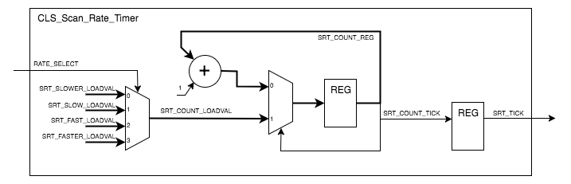

The framework provides a skeleton module and the parameter calculations for the four different scan rates.  These parameter calculations are a variation of those presented with the HDL Start Guide examples.

**Implementation Steps:**

1. Implement a combinatorial 4-input multiplexer for the counter load values using the provided parameter values.  

	The `RATE_SELECT` input will select the rate based on the following table:

 	| Rate   | `RATE_SELECT` | Parameter |
	|--------|:---:|:-----:|
	| 2 Hz   |  0  |  `SRT_SLOWER_LOADVAL` |
	| 8 Hz   |  1  |  `SRT_SLOW_LOADVAL`   |
	| 16 Hz  |  2  |  `SRT_FAST_LOADVAL`   |
	| 32 Hz  |  3  |  `SRT_FASTER_LOADVAL` |
	
	Refer to the Multiplexer section of the [HDL Starter Guide](HDL-StarterGuide.md#multiplexers) making sure to use the **non-registered** example.

1. Implement a rollover counter for the timer using the previous timers as reference.

	In this case, instead of loading the counter from a load value parameter, the output from the multiplexer will be used.
	
1. Implement a register for the `SRT_TICK` output.


### CLS LED Output Multiplexer

The `CLS_LED_Output_Multiplexer` module requires completing all implementation steps, no framework code is provided.  You may choose to code the module using either Verilog or VHDL.

**Implementation Steps:**

1. Create a new file in Quartus for the `CLS_LED_Output_Multiplexer` module making sure to set the file type to either **Verilog HDL File** or **VHDL File** depending on your language preference.

	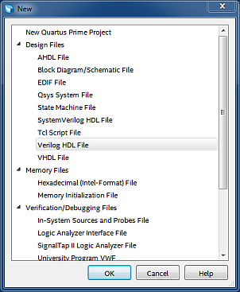

1. Save the file as `CLS_LED_Output_Multiplexer.v` (or `CLS_LED_Output_Multiplexer.vhd` for VHDL).

	The _Save As_ dialog has a checkbox to add the file to the project.  Make sure this is checked.

	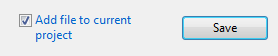

1. Using the framework files as an example, add a comment header block and a module definition for `CLS_LED_Output_Multiplexer`.

	The module port list should include these signals:
	
	| Signal Name | Direction | Width | Purpose |
	|------------|-------|------|----|
	| PWM\_CHANNEL\_SIGS | input | 10 | PWM Channels |
	| PWM\_TIMER\_TICK | input | 1 | PWM Interval Timer Tick |
	| SRT\_TICK | input | 1 | Scan Rate Timer Tick |
	| LEDR | output | 10 | LED Output Signals |
	| CLK | input | 1 | System Clock |

1. The functional structure of the module is shown in the following block diagram:

	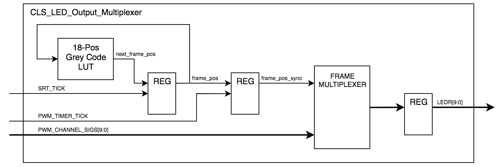

	The input signals from the PWM generators (`PWM_CHANNEL_SIGS`) are multiplexed to the LED outputs (`LEDR`) based on the current frame position. By cycling through the frame table, the resulting animation will show an LED bouncing back and forth leaving a POV trail. 

1. The Frame position is tracked with an 18-position Grey Code Counter.  A simple look-up table with an output register can generate the next grey code from the current code based on the following table. 

	| Frame   | Grey Code  | Next Value |
	|---------|:------:|:---------:|
	| Frame 0  | 00000 | 00001 |
	| Frame 1  | 00001 | 00011 |
	| Frame 2  | 00011 | 00010 |
	| Frame 3  | 00010 | 00110 |
	| Frame 4  | 00110 | 00111 |
	| Frame 5  | 00111 | 00101 |
	| Frame 6  | 00101 | 00100 |
	| Frame 7  | 00100 | 01100 |
	| Frame 8  | 01100 | 11100 |
	| Frame 9  | 11100 | 10100 |
	| Frame 10 | 10100 | 10101 |
	| Frame 11 | 10101 | 10111 |
	| Frame 12 | 10111 | 10110 |
	| Frame 13 | 10110 | 10010 |
	| Frame 14 | 10010 | 10011 |
	| Frame 15 | 10011 | 10001 |
	| Frame 16 | 10001 | 10000 |
	| Frame 17 | 10000 | 00000 |

	The table has 18 grey code values that will automatically loop.  The index space has 32 total entries so there are 14 unused code that are invalid.  These invalid table entries should all be set to 00000 so if a glitch occurs the loop will start over.
	
	See the Look-Up Table section of the [HDL Starter Guide](HDL-StarterGuide.md#look-up-tables) for details on implementing the table.
	
1. The output from the Frame Position table, `next_frame_pos`, will be registered when the `SRT_TICK` signal asserts.  This will advance the Frames at the rate define by the Scan Rate Timer.
	
	Implement a gated register to store the value of `next_frame_pos` (on the rising clock edge) when the `SRT_TICK` signal is high.  The register output will be the `frame_pos` signal.

	See the Gated Register section of the [HDL Starter Guide](HDL-StarterGuide.md#registers) for details on implementing the register.

1. The updated Frame Position, `frame_pos`, is registered again, when `PWM_TIMER_TICK` asserts, to align the Frame change to the start of a new PWM Interval.  This avoids the possibility of creating a weird glitch on the LEDs due to changing the rate in the middle of a cycle (although at 1kHz it wouldn't be noticeable to the human eye).

	Implement another gated register to store the value of `frame_pos` (on the rising clock edge) when the `PWM_TIMER_TICK` signal is high.  The register output will be the `frame_pos_sync` signal.

1. Finally, the Frame Multiplexer routes the PWM generator signals to the LED outputs based on the current Frame position.  The following table shows the patterns for each frame (the number shown is the PWM Duty Cycle value).

	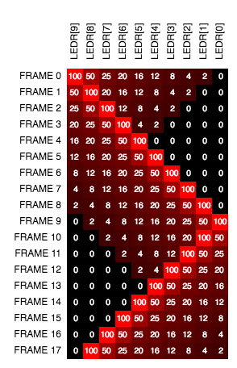

	The actual multiplexer assignments are listed in the table.
	
	| Frame | Index | LEDR[9] | LEDR[8] | LEDR[7] | LEDR[6] | LEDR[5] | LEDR[4] | LEDR[3] | LEDR[2] | LEDR[1] | LEDR[0] |
	|-------|-------|:-------:|:-------:|:-------:|:-------:|:-------:|:-------:|:-------:|:-------:|:-------:|:-------:|
	|   0   | 00000 | pchs[9] | pchs[8] | pchs[7] | pchs[6] | pchs[5] | pchs[4] | pchs[3] | pchs[2] | pchs[1] | pchs[0] |
	|   1   | 00001 | pchs[8] | pchs[9] | pchs[6] | pchs[5] | pchs[4] | pchs[3] | pchs[2] | pchs[1] | pchs[0] | pchs[0] |
	|   2   | 00011 | pchs[7] | pchs[8] | pchs[9] | pchs[4] | pchs[3] | pchs[2] | pchs[1] | pchs[0] | pchs[0] | pchs[0] |
	|   3   | 00010 | pchs[6] | pchs[7] | pchs[8] | pchs[9] | pchs[2] | pchs[1] | pchs[0] | pchs[0] | pchs[0] | pchs[0] |
	|   4   | 00110 | pchs[5] | pchs[6] | pchs[7] | pchs[8] | pchs[9] | pchs[0] | pchs[0] | pchs[0] | pchs[0] | pchs[0] |
	|   5   | 00111 | pchs[4] | pchs[5] | pchs[6] | pchs[7] | pchs[8] | pchs[9] | pchs[0] | pchs[0] | pchs[0] | pchs[0] |
	|   6   | 00101 | pchs[3] | pchs[4] | pchs[5] | pchs[6] | pchs[7] | pchs[8] | pchs[9] | pchs[0] | pchs[0] | pchs[0] |
	|   7   | 00100 | pchs[2] | pchs[3] | pchs[4] | pchs[5] | pchs[6] | pchs[7] | pchs[8] | pchs[9] | pchs[0] | pchs[0] |
	|   8   | 01100 | pchs[1] | pchs[2] | pchs[3] | pchs[4] | pchs[5] | pchs[6] | pchs[7] | pchs[8] | pchs[9] | pchs[0] |
	|   9   | 11100 | pchs[0] | pchs[1] | pchs[2] | pchs[3] | pchs[4] | pchs[5] | pchs[6] | pchs[7] | pchs[8] | pchs[9] |
	|   10  | 10100 | pchs[0] | pchs[0] | pchs[1] | pchs[2] | pchs[3] | pchs[4] | pchs[5] | pchs[6] | pchs[9] | pchs[8] |
	|   11  | 10101 | pchs[0] | pchs[0] | pchs[0] | pchs[1] | pchs[2] | pchs[3] | pchs[4] | pchs[9] | pchs[8] | pchs[7] |
	|   12  | 10111 | pchs[0] | pchs[0] | pchs[0] | pchs[0] | pchs[1] | pchs[2] | pchs[9] | pchs[8] | pchs[7] | pchs[6] |
	|   13  | 10110 | pchs[0] | pchs[0] | pchs[0] | pchs[0] | pchs[0] | pchs[9] | pchs[8] | pchs[7] | pchs[6] | pchs[5] |
	|   14  | 10010 | pchs[0] | pchs[0] | pchs[0] | pchs[0] | pchs[9] | pchs[8] | pchs[7] | pchs[6] | pchs[5] | pchs[4] |
	|   15  | 10011 | pchs[0] | pchs[0] | pchs[0] | pchs[9] | pchs[8] | pchs[7] | pchs[6] | pchs[5] | pchs[4] | pchs[3] |
	|   16  | 10001 | pchs[0] | pchs[0] | pchs[9] | pchs[8] | pchs[7] | pchs[6] | pchs[5] | pchs[4] | pchs[3] | pchs[2] |
	|   17  | 10000 | pchs[0] | pchs[9] | pchs[8] | pchs[7] | pchs[6] | pchs[5] | pchs[4] | pchs[3] | pchs[2] | pchs[1] |

	Refer to the [HDL Starter Guide](HDL-StarterGuide.md#multiplexers) for an example multiplexer implementation.

	**Implementation Hint:**
	
	The LED outputs could be implemented as ten separate multiplexers, one for each LED output but that ends up being a lot of code, much of which is duplicated.  
	
	The most efficient way to assign the PWM channels to the LED outputs would be to use the concatenation operator as shown in this code snippet.
	
	```
	wire [9:0] pchs = PWM_CHANNEL_SIGS; 
	LEDR <= { pchs[9], pchs[8], pchs[7], pchs[6], pchs[5], pchs[4], pchs[3], pchs[2], pchs[1], pchs[0] };
	```
	
	Note how the `pchs` variable is used to shorten the concatenation line length by renaming the `PWM_CHANNEL_SIGS` variable.  This helps with code readability.
	

## Debugging with Simulation 

The simulator is the best debugging tool available for an FPGA designer.  Behavioral simulation allows testing a module's functionality before being integrated with rest of the design and without hardware.  The Quartus Design Software includes the ModelSim simulator which was introduced in the first lab. 

In general, a simulation test bench will instantiate the module being tested (aka Unit Under Test (UUT)), emulate support hardware components, generate test stimulus inputs, and verify the resulting UUT outputs.

For this lab, a simulation test bench for the full design has been provided with the lab framework in the module named `TF_EECS301_Lab2_TopLevel`.  The UUT for this test bench is the top level module, `EECS301_Lab2_TopLevel`.  

Simulation test benches typically require various parts of the system to be emulated so the UUT has the proper input and output stimulus to function properly.  Emulated components may be other modules from the design (usually ones the UUT connects to normally) or may be simulation models of hardware devices outside the FPGA (i.e. oscillator, switches, ADC).  The only hardware component emulation needed for this test bench is the 50 MHz clock source and the slider switch inputs.

The emulation for the 50MHz clock simply toggles a signal high and low at a set interval in an infinite loop.  This emulation structure will be used in all the labs so you probably want to take a look at how it works.

The following image shows the simulation results after running for 600 ms.  The LED outputs can be seen changing every 31.25 ms (32 Hz).  Running the simulation for 600 ms takes a few minutes so it's better off to start with a smaller time window first (like 10 ms) to make sure there are no major issues (Error messages, Warning messages, or uninitialized signals shown by red lines), then run the simulation longer to see the scanning pattern.

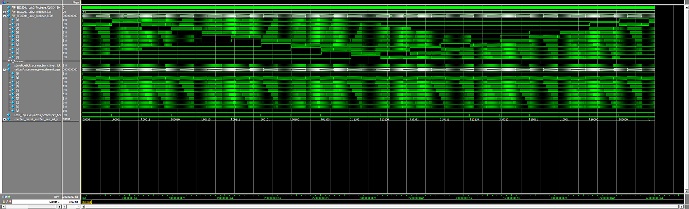

**NOTE:** The test bench files provided with the lab framework have the prefix `TF_` (for Test Fixture).  There is nothing magic with this prefix, it's simply an old convention to make it easier group test bench files.  In newer Quartus projects, test bench files may have the extension `.vt` but this is not standard with other FPGA development tools so the standard `.v` is used instead.


### Setting Up the Simulation

After writing a test bench module (or in this case using the one provided), Quartus needs configured to run the simulation.  This process was covered in the **Lab 1 ModelSim Overview Guide** but will be briefly reiterated here (refer back to Lab 1 for full details).

**Setup Steps:**

1. On the **Tasks** panel, change the design flow from _Compilation_ to _RTL Simulation_.

1. From the task list, double-click on **Edit Settings** under **RTL Simulation** to bring up the **Simulation** settings window.

1. Add a new test bench by first selecting the **Compile test bench** option in the **NativeLink settings** box (in the lower part of the window).

1. Next, click on the **Test Benches...** button to bring up the **Test Benches** dialog.

1. Add a new Test Bench by clicking on the **New...** button to bring up the **New Test Bench Settings** dialog.

1. In the **New Test Bench Settings** dialog, set the following settings...

	* Set Test Bench name to **TF\_EECS301\_Lab2\_TopLevel**
	* Set Top level module to **TF\_EECS301\_Lab2\_TopLevel**
		* **Warning:** These names are not the filename so do **not** append a `.v` to the module name. You'll get some really confusing, non-obvious error messages if you do.
	* Set Simulation end time to **100uS**
		* Note: This is the initial run-time, once in ModelSim you can run as much time as you need.
	* Add the **TF\_EECS301\_Lab2\_TopLevel.v** file
		* Note: After selecting the test bench file in the **Select File** dialog, the **Add** button must still be clicked before it is added to the list.

	Here's what the dialog should look like after entering the parameters:
	
	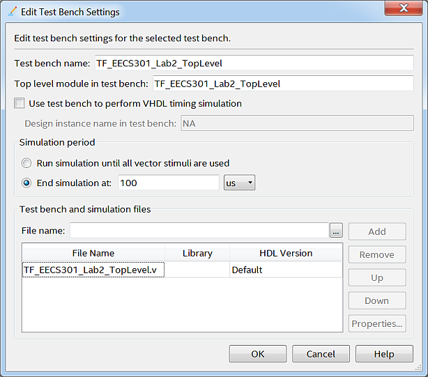
	
1. After entering all the parameters, click the **OK** button to save the settings.

1. Back on the **Test Benches** window, you should see your new test bench listed.
	
	Click on the **OK** button to exit.

1. Back on the **Settings** window:

	The new test bench should now be listed in the Test Bench drop-down list.

	Set the simulation setup script, **_simulation/modelsim/wave.do_**, to automatically configure the ModelSim waveform signals. 

1. We should be done with the setup now.  Double-check your settings appear the same as the **Settings** window shown here:

	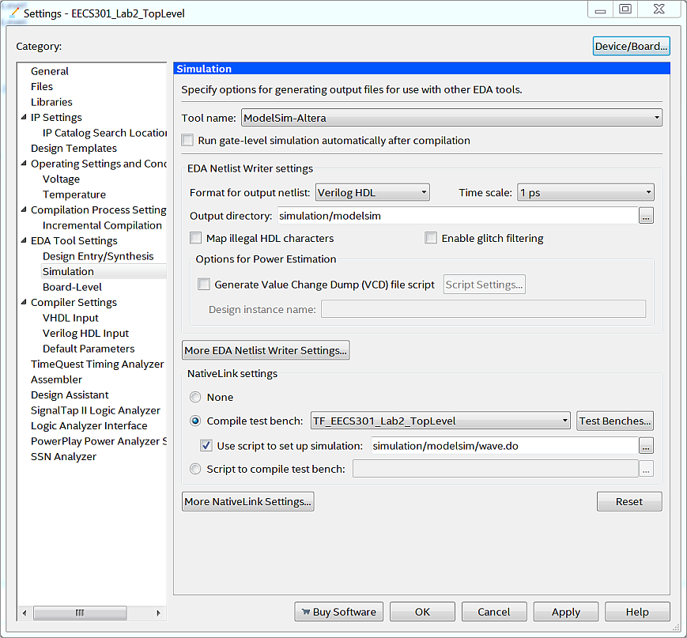

1. Click **OK** to save the settings.

The Test Bench settings only need to be configured once per design. The simulation can now be run from the main window.


### Running the Simulation

When the ModelSim waveform window loads, the simulation setup script, `wave.do`, adds in signals to monitor for the project.  This setup script is created by saving the waveform format.  You can add or remove signals or change the signal formatting in the waveform window and save the changes for your project.

**WARNING:** The simulation should only take at most a couple minutes to run.  If it is taking longer then something is probably wrong.  Double-check to see if there were any error or warning messages.  Quit ModelSim and try to re-run the project after fixing any issues found.

**ModelSim Launch Steps:**

1. Select the **RTL Simulation** flow from the **Tasks** pane drop-down list.

1. In the **Tasks** pane, double-click **RTL Simulation** to start the simulation.

	The **Analysis & Elaboration** process will be run before the simulator launches.  If there are errors in your code, this process may fail so you'll have to fix those bugs first.

	:warning: The ModelSim synthesizer does a better job catching minor issues so make sure to review the **Transcript** window for warning messages.

	:warning: If the ModelSim encounters an error during the compilation, it might stop the startup process and not open all the windows.  If this happens, find the error message in the Transcript window, then quit ModelSim and go fix the problem in Quartus.  Retry launching ModelSim after fixing the issue.
	
	Refer back to the **Lab 1 ModelSim Overview Guide** for an overview of the ModelSim windows.

### Simulation Debugging

The simulator can monitor any signal in the design, allowing a wide range of debugging capability.  As you debug various sections of the design, you can add or remove signals from the waveform window to zero in on the problem.  

**NOTE:** When you add a signal to the waveform window, the simulation will need to be re-run before the signal data is captured.  Used the **Restart** and **Run** toolbar buttons to re-run the simulation.

Multiple cursors can be placed in the waveform window.  Cursors are one of the more useful simulator debugging features.  The time between events can be measured by setting a cursor at each even.  For instance, the time between timer ticks can be measured to verify the correct number of clock cycles are being counted.  If the counter load value is miscomputed then the time between events will be off.


### Lab Report Requirement

After getting the lab project working, run the simulation for 600 ms (this may take 5-6 minutes), capture the simulation waveform window, and add the captured image to the Lab Report.

:information_source: The waveform can be captured by clicking in the waveform window, then selecting **File** -> **Export** -> **Image** from the menubar.  Set the image type to **PNG** and save the image in the **Lab2-Report** directory.  If you have problems, refer back to the Screen Capture Guide from Lab 1.


## Load the Design on the Dev Board

After getting the design to compile and verifying the logic with the simulator, the final (or first iteration) step is to load the design on the hardware.

Setting up and loading the design on the hardware development board will be done the same as was done in Lab 1.

For the Lab 2 project, the programming file in the `output_files` directory will be named `EECS301_Lab2_TopLevel.sof`.

Refer back to the Lab 1 Development Kit Hardware Guide for the full loading process, using the `EECS301_Lab2_TopLevel.sof` file of course.

---

Return to the [Lab 2 Assignment](../README.md) page...