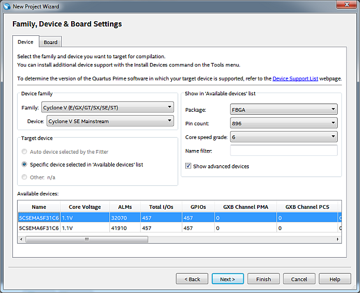
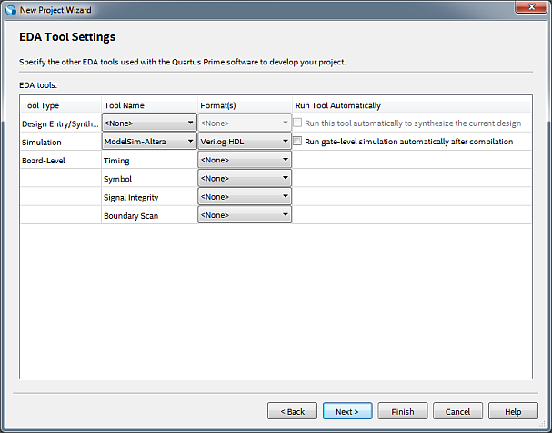

# Lab #2 Quartus Project Guide

This guide details the Quartus Project creation steps needed for Lab 2.  The steps mostly reiterate the steps from Lab 1 but with different names and framework files.

## Lab Assignment Repository

If you haven't already, clone the lab assignment repository to your local development machine with Git (using the same procedure from Lab 1).  If using the lab machines, remember to clone the repository to the H drive.

## Create the Quartus Project

The Quartus Project will be created using the **New Project Wizard** and importing the framework code that was included in the Lab Assignment repository.

### Assignment Step:

1. Start Quartus Prime 17.0.

1. From the menubar, select **File** -> **New Project Wizard...** to create a new project.

	Enter the following parameters in the **New Project Wizard** dialog:
	
	* Set the project working directory to the `Lab2-Project` directory of the Lab Assignment repository.
	* Name the project: `EECS301_Lab2_Project`
	* Name the top level design entity: `EECS301_Lab2_TopLevel`
	* **Verify** the settings match the following image (your project directory path may differ).

	:warning: **WARNING:** Make sure the project name and top level design entity listed are entered exactly as shown, including capitalization.

	
	
	Click the  button.

1. Select **Empty Project** for the **Project Type**:

	

	Click the  button.

1. Add framework files to the Project.

	The following files were distributed with the lab assignment repository in the `Lab2-Project` directory:

	```
	EECS301_Lab2_TopLevel.v
	TF_EECS301_Lab2_TopLevel.v
	EECS301_Lab2_Project.sdc
	StdFunctions.vh
	CLS_Scanner_Module.v
	CLS_Scan_Rate_Timer.v
	CLS_PWM_Interval_Timer.v
	CLS_PWM_DutyCycle_Timer.v
	```
	
	Add these files to the project using the **Add Files** dialog:
	
	
	
	**NOTE:** The small button `...` to the right of the File Name text box will open a Select File dialog where you can select multiple files to add.
	
	**NOTE:** The file type filter needs to be adjusted in order to show the **.sdc** file in the file dialog.
	
	**WARNING:** Quartus may generate errors if non-design files are added to the project so make sure to only add what is specified in the above list.
	
	After adding the files, update the **Type** of the simulation test bench file `TF_EECS301_Lab2_TopLevel.v` by selecting it in the file list and clicking the **Properties** button to open the **File Properties** dialog.
	
	

	Select **Verilog Test Bench File** from the **Type** drop-down list then click the **OK** button to save the change.
	
	The completed file list will look like this:
	
	

	After all the files have been added and types updated, click the  button.

1. Select the FPGA device for the project.

	:information_source: The DE1-SoC Development Board has an Altera Cyclone V SE FPGA.

	Make the following parameter selections in the **Family, Device & Board Settings** dialog:
	
	* Family: **Cyclone V (E/GX/GT/SX/SE/ST)**
	* Device: **Cyclone V SE Mainstream**
	* Package: **FBGA**
	* Pin count: **896**
	* Core speed grade: **6**

	After making the selections, there should be two options in the **Available Device** list.  Select **5CSEMA5F31C6** from the list.
	
	The final Settings dialog will look like this:
	
	

	After selecting the correct FPGA, click the  button.

1. EDA Tool Settings. 

	Set the **Simulation Tool** to **ModelSim-Altera** and change the **Simulation Format** to **Verilog HDL**.

	

	Click the  button.

1. The Summary page should look like this...

	

1. Click **Finish** to generate the project.

	The project will be generated and take you back to the main Quartus window with the project loaded.

1. Next, load the pin assignments for the project.

	From the menubar, select **Assignments** -> **Import Assignments...**

	**NOTE:** The pin assignments for this project are stored in the file `Lab2_Project_Assignments.qsf`.  
	
	Click the `...` button and select the `Lab2_Project_Assignments.qsf` pins file from the file browser.

	

	Click the **OK** button to apply the pin assignments to the project.

The project is now created and ready to be used for the lab assignment.

Jump to the [**Lab 2 Project Guide**](Lab2-ProjectGuide.md) to begin...

---

Return to the [Lab 2 Assignment](../README.md) page...
