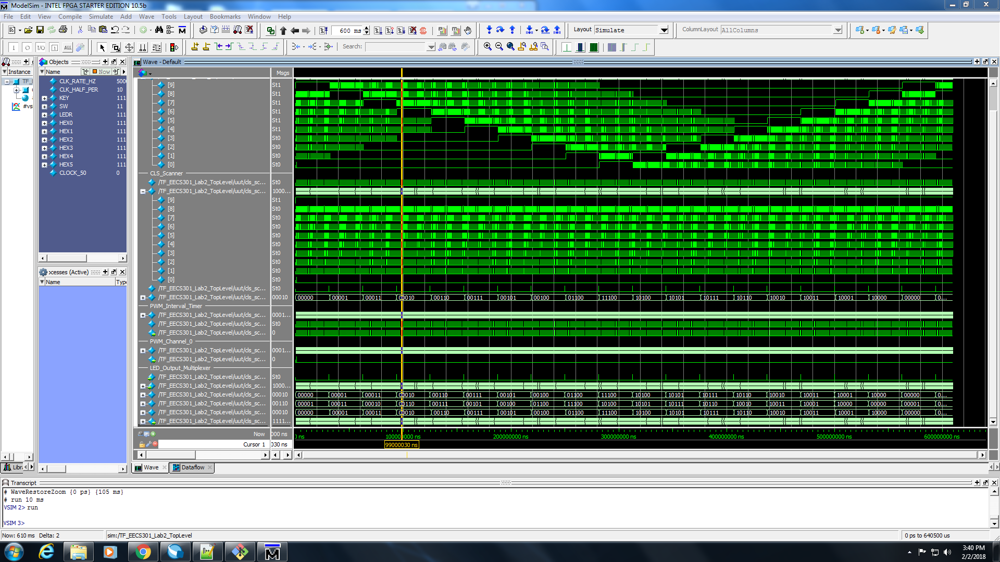

# EECS301 Lab #2 Report

* **Andrea Norris** (adn33@case.edu)
* **Team #6**
* **GitHub User: AndreaN33**

## Introduction
This system generates a scanning LED pattern, with the ability to select between 4 distinct speeds using
two switches on the board. 

## Implementation Details
The system uses a pulse width modulator to adjust LED brightness levels, and scanning movement is controlled
by a multiplexer, changing the LED output every time the scan rate timer generates a tick. The switch inputs
are monitered by the scanner, which then controls at what frequency the interval timer ticks.

## Verification Results
This lab was verified using testbench simulation in ModelSim, which demonstrated the intended LED switching 
pattern. The image is included below.

## Conclusions
In this lab I learned how to debug Verilog on Quartus at a level I had not understood before. I also learned 
that the TA's are extremely helpful.

## Computer Usage Information & Time Spent
For this project I used the lab computers, and spent 13 hours total writing and debugging.

## Difficulties / Issues
My biggest difficulty with this lab was understanding how the structure of the project was supposed to work. 
It made it difficult to start the project because I didn't understand the code I was supposed to be writing.
Another difficulty I had was the debugging process, I had some unusual errors and most of the people and TA's
I asked were only able to help so much, which added several hours to my work time. 
